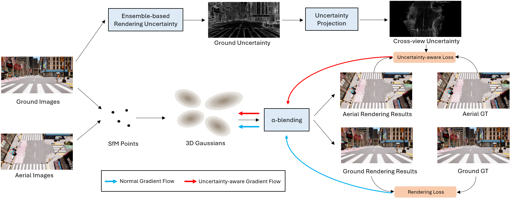

# Drone-assisted Road Gaussian Splatting with Cross-view Uncertainty

[Saining Zhang](https://sainingzhang.github.io/), Baijun Ye, Xiaoxue Chen, [Yuantao Chen](https://tao-11-chen.github.io/), Zongzheng Zhang, Cheng Peng, Yongliang Shi, [Hao Zhao](https://sites.google.com/view/fromandto) <br />


[[`Project Page`](https://sainingzhang.github.io/project/uc-gs/)][[`arxiv`](https://arxiv.org/abs/2408.15242)]


## Overview

<p align="center">

</p>


We introduce UC-GS, a novel uncertainty-aware 3D-GS training paradigm to effectively use aerial imagery to enhance the NVS of road views.

Our method performs superior on details during viewpoint shifting.


<p align="center">

</p>


## Installation

We tested on a server configured with Ubuntu 18.04, cuda 11.6 and gcc 9.4.0. Other similar configurations should also work, but we have not verified each one individually.

1. Clone this repo:

```
git clone https://github.com/SainingZhang/UC-GS.git --recursive
cd UC-GS
```

2. Install dependencies

```
SET DISTUTILS_USE_SDK=1 # Windows only
conda env create --file environment.yml
conda activate uc_gs
```

## Data

The Synthetic dataset is available in [Google Drive](https://drive.google.com/file/d/1DjSB7GqORz5rUvB3KaAMIiGwX1mtmRjb/view?usp=sharing).


## Training

```
bash ./single_train.sh
```

- scene: scene name with a format of ```dataset_name/scene_name/``` or ```scene_name/```;
- exp_name: user-defined experiment name;
- gpu: specify the GPU id to run the code. '-1' denotes using the most idle GPU. 
- voxel_size: size for voxelizing the SfM points, smaller value denotes finer structure and higher overhead, '0' means using the median of each point's 1-NN distance as the voxel size.
- update_init_factor: initial resolution for growing new anchors. A larger one will start placing new anchor in a coarser resolution.


## Evaluation

```
python render.py -m <path to trained model> # Generate renderings
python metrics.py -m <path to trained model> # Compute error metrics on renderings
```

## Cite

```
@misc{https://doi.org/10.48550/arxiv.2408.15242,
  doi = {10.48550/ARXIV.2408.15242},
  url = {https://arxiv.org/abs/2408.15242},
  author = {Zhang,  Saining and Ye,  Baijun and Chen,  Xiaoxue and Chen,  Yuantao and Zhang,  Zongzheng and Peng,  Cheng and Shi,  Yongliang and Zhao,  Hao},
  keywords = {Computer Vision and Pattern Recognition (cs.CV),  FOS: Computer and information sciences,  FOS: Computer and information sciences},
  title = {Drone-assisted Road Gaussian Splatting with Cross-view Uncertainty},
  publisher = {arXiv},
  year = {2024},
  copyright = {arXiv.org perpetual,  non-exclusive license}
}
```

## Related Work

[Scaffold-GS](https://github.com/city-super/Scaffold-GS)
